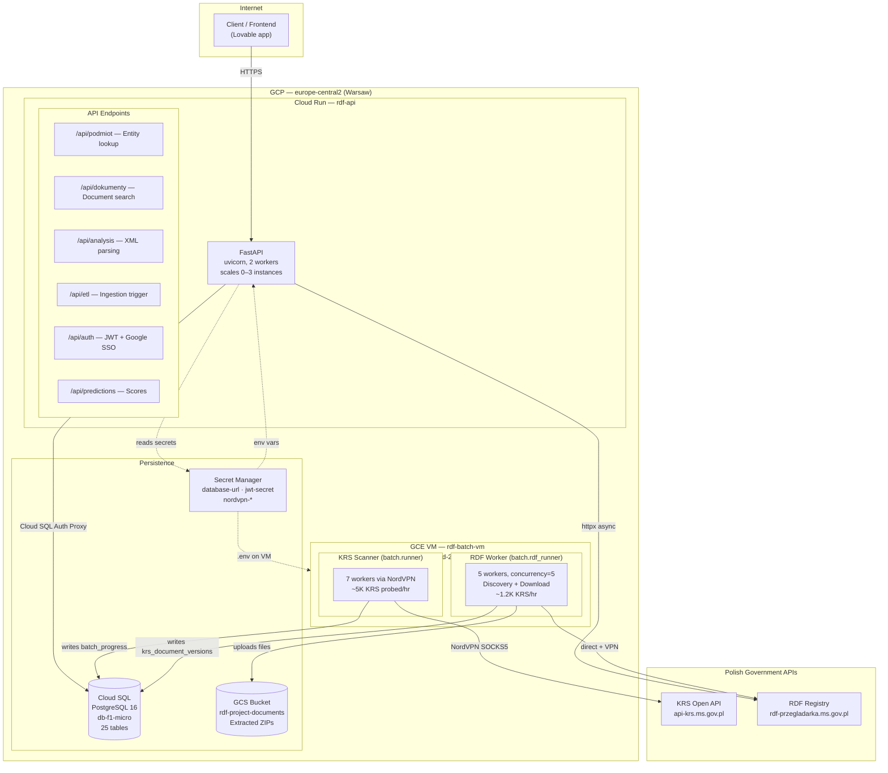

# Architecture Review

**Date:** 2026-04-01
**Scope:** Full system review — deployment, data flow, resilience, security, and recommendations

## System Overview

The RDF API project is a data pipeline + API system that:
1. **Discovers** valid KRS entity numbers by probing the Polish KRS Open API
2. **Scrapes** financial documents from the RDF registry for each discovered entity
3. **Stores** documents in GCS and metadata in PostgreSQL
4. **Parses** XML financial statements into structured line items
5. **Computes** financial ratios and bankruptcy prediction scores
6. **Serves** predictions and analysis via a FastAPI REST API

## Architecture Diagram

> Renders natively on GitHub. Source: [`docs/architecture.mmd`](architecture.mmd)



## Data Flow

```text
1. DISCOVER       KRS Scanner probes integers 1..N against KRS Open API
                   Found entities → batch_progress (status=found)

2. SEARCH          RDF Worker takes found KRS numbers
                   Encrypted search → discovers document listings
                   Results → krs_document_versions (discovery)

3. DOWNLOAD        RDF Worker fetches metadata + ZIP per document
                   ZIP → extracted to GCS (rdf-project-documents)
                   Metadata → krs_document_versions (downloaded)

4. INGEST (ETL)    XML parser extracts financial statements
                   → financial_reports + financial_line_items (EAV)

5. COMPUTE         Feature engine calculates ratios from line items
                   → computed_features (EAV, keyed by report_id + feature)

6. PREDICT         Maczynska model scores each report
                   → predictions table with risk category + SHAP

7. SERVE           FastAPI exposes predictions via /api/predictions/{krs}
                   JWT auth + per-KRS access control
```

## Component Assessment

### Strengths

| Area | What works well |
|------|----------------|
| **Batch architecture** | Multiprocessing + async per worker. Good separation of KRS scanning vs RDF scraping. Stride partitioning avoids contention |
| **Append-only versioning** | `krs_entity_versions` and `krs_document_versions` provide full audit trail with `is_current` flag for fast reads |
| **Resumability** | KRS scanner uses a cursor table; RDF worker checks `batch_rdf_progress` before re-processing. Crash-safe |
| **Connection patterns** | Per-request pooled connections for the API (ContextVar), short-lived connections for batch workers. Clean separation |
| **Feature store design** | EAV pattern for `computed_features` means adding new features requires no schema changes — just INSERT metadata |
| **Retry/backoff in batch** | Exponential backoff with jitter for rate limits, adaptive delay escalation, cooldown after sustained failures |

### Weaknesses and Risks

#### 1. Single database, no read replicas

All 25 tables in one `db-f1-micro` instance. The batch workers write heavily (document versions, progress tracking) while the API reads. As data grows, write contention will impact API latency.

**Risk:** Medium now, High at 500K+ documents
**Recommendation:** Upgrade to `db-custom-2-4096` minimum. Consider a read replica for the API if query latency degrades.

#### 2. No retry/backoff on the API's RDF client

`app/rdf_client.py` is a plain `httpx.AsyncClient` with no retry logic. If the upstream RDF API returns 503 or times out, the user gets a raw 502. The batch workers have sophisticated retry — the API does not.

**Risk:** Medium — user-facing errors during upstream blips
**Recommendation:** Add a retry decorator (2 attempts, 1s backoff) to `rdf_client.py` calls, or use `httpx`'s transport-level retry.

#### 3. Batch worker connections are not pooled

Each `_with_conn()` call in `RdfDocumentStore` opens a new psycopg2 connection, runs one query, and closes it. For a KRS with 20 documents, that's 40+ connection open/close cycles.

**Risk:** Medium — connection overhead at scale, potential `max_connections` exhaustion on Cloud SQL (db-f1-micro allows ~25 connections)
**Recommendation:** Use a per-worker connection pool (even a simple single persistent connection per store instance).

#### 4. Preemptible VM for batch workers

`rdf-batch-vm` is preemptible — GCP can terminate it at any time (max 24h). While the scanner and RDF worker are resumable, an abrupt kill during a GCS upload could leave partial files.

**Risk:** Low (resumable design), but 24h max lifetime means daily restarts
**Recommendation:** Add a startup script or systemd `ExecStartPre` that runs `git pull` + `pip install` on boot, so the VM self-heals after preemption.

#### 5. No structured observability

Logs go to stdout/journalctl. No metrics export (Prometheus, Cloud Monitoring), no distributed tracing, no alerting on error rate spikes or worker crashes.

**Risk:** Medium — hard to detect issues without watching logs manually
**Recommendation:** Start with Cloud Monitoring agent on the VM + a simple Prometheus `/metrics` endpoint on the API. Alert on: worker process count, error rate > 5%, download rate drop.

#### 6. CORS misconfiguration

`allow_origins=["*"]` with `allow_credentials=True` is insecure. Any website can make authenticated cross-origin requests.

**Risk:** High for production with real users
**Recommendation:** Set `CORS_ORIGINS` to the actual frontend domain. Remove `allow_credentials=True` if not needed.

#### 7. No database backup strategy

Cloud SQL has automated backups (enabled by default), but there's no documented backup/restore procedure, no point-in-time recovery testing, and the old DuckDB backup cron in `deploy/rdf-backup.cron` is stale.

**Risk:** Medium — data loss if Cloud SQL instance is deleted or corrupted
**Recommendation:** Verify automated backups are enabled. Document restore procedure. Test recovery quarterly.

## Database Schema Assessment

```text
Layer 1: Entity discovery      batch_progress, krs_entities, krs_entity_versions
Layer 2: Document discovery     batch_rdf_progress, krs_documents, krs_document_versions
Layer 3: Financial data         financial_reports, raw_financial_data, financial_line_items
Layer 4: Features               feature_definitions, feature_sets, computed_features
Layer 5: Predictions            model_registry, predictions, prediction_runs
Layer 6: Auth                   (inline in auth module — users, verification, access grants)
Layer 7: Jobs                   krs_scan_cursor, krs_scan_runs, krs_sync_log, assessment_jobs
```

**Good:** Clear layering. Each layer depends only on layers below it.
**Concern:** The EAV pattern in `financial_line_items` and `computed_features` is correct for flexibility but will need indices tuned as data grows. The `latest_successful_financial_reports` view should be materialized if query latency becomes an issue.

## Deployment Assessment

| Aspect | Current | Assessment |
|--------|---------|------------|
| **API deploy** | `gcloud run deploy --source .` | Good — immutable container images via Cloud Build |
| **Batch deploy** | `git pull` + `systemctl restart` | Adequate for single VM. No rollback mechanism beyond `git checkout` |
| **Secrets** | Secret Manager for DB/JWT/VPN | Good — secrets not in code or env files |
| **Config** | `.env` on VM, env vars on Cloud Run | Adequate. VM .env is not version-controlled (correct) |
| **Rollback** | Cloud Run: revisions. VM: git | Cloud Run is solid. VM rollback is manual |
| **CI/CD** | None | Missing — all deploys are manual |

## Recommended Next Steps (prioritized)

### Immediate (this week)

1. **Fix CORS** — set actual frontend origin, remove wildcard
2. **Add VM startup script** — auto-pull + auto-restart services after preemption
3. **Upgrade Cloud SQL** — `db-f1-micro` is too small for current write volume

### Short-term (next 2 weeks)

4. **Add retry to API's RDF client** — 2 retries with backoff for user-facing calls
5. **Pool batch worker DB connections** — persistent connection per store, not per-operation
6. **Cloud Monitoring** — install ops-agent on VM, export batch worker metrics
7. **Update `deploy/rdf-backup.cron`** — replace stale DuckDB backup with Cloud SQL export script

### Medium-term (next month)

8. **CI/CD pipeline** — GitHub Actions: run tests on PR, deploy to Cloud Run on merge
9. **Cloud SQL read replica** — separate read path (API) from write path (batch workers)
10. **Structured logging** — JSON logs with Cloud Logging integration for searchable dashboards
11. **Alert on batch worker health** — process count, error rate, download velocity drop
